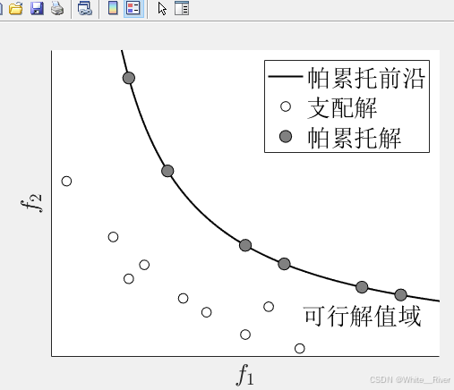

====================================================================
# TPMS-ML: Surrogate Modeling & Multi-Objective Optimization
====================================================================

Author: 武昊东（WUST）
Project: Level 2 → Level 3 原理与代码逻辑全解
Keywords: CFD, Machine Learning, Random Forest, NSGA-II, TPMS Structures

--------------------------------------------------------------------
一、Level 2：CFD → ML 代理模型原理
--------------------------------------------------------------------

【1】为什么要用代理模型？
--------------------------------
CFD（计算流体力学）仿真虽然精度高，但计算代价巨大。
每一次仿真都可能耗时几十分钟到数小时。

为了能快速搜索最优设计，需要用机器学习构建一个“代理模型 (Surrogate Model)”：
它通过学习 CFD 的输入-输出关系，实现快速预测。

数学形式：
    y = f_CFD(x)   →   由机器学习得到近似模型  ŷ = f_ML(x)

输入变量 x = [u_in, t_wall, lx, tpms_type]
输出变量 y = [dp_per_L, perm]

最终得到两个模型：
    - 模型①：预测渗透率 perm
    - 模型②：预测压降 dp_per_L

--------------------------------
【2】数据与特征设计
--------------------------------
设计变量：
    数值型: u_in, t_wall, lx
    类别型: tpms_type  (结构类型: G / KEL / VOR)
输出目标：
    dp_per_L（单位压降） → 越小越好
    perm（渗透率） → 越大越好

在代码中：
    num_cols = ["u_in", "t_wall", "lx"]
    cat_cols = ["tpms_type"]

--------------------------------
【3】模型原理：随机森林回归
--------------------------------
随机森林 (Random Forest) = 多棵决策树的集成学习模型。
每棵树都在不同的样本和特征子集上学习。

预测公式：
    ŷ = (1/N) * Σ T_i(x)

优点：
    - 能处理非线性关系
    - 不要求标准化
    - 适合多维物理特征

在代码中：
    rf = RandomForestRegressor(
        n_estimators=500,
        max_depth=22,
        random_state=42,
        n_jobs=-1
    )

--------------------------------
【4】输入管线与特征处理
--------------------------------
使用 scikit-learn 的 ColumnTransformer：

    preproc = ColumnTransformer([
        ("num", "passthrough", num_cols),
        ("cat", OneHotEncoder(handle_unknown="ignore", sparse_output=False), cat_cols)
    ])

完整训练流程：
    model = Pipeline([
        ("prep", preproc),
        ("rf", rf)
    ])
    model.fit(X_train, y_train)

--------------------------------
【5】模型评估指标
--------------------------------
评价指标：
    R²    拟合优度，越接近 1 越好
    MAE   平均绝对误差
    RMSE  均方根误差

代码片段：
    metrics = {
        "r2_test": r2_score(y_test, y_pred_test),
        "mae_test": mean_absolute_error(y_test, y_pred_test),
        "rmse_test": np.sqrt(mean_squared_error(y_test, y_pred_test))
    }

--------------------------------
【6】可视化逻辑
--------------------------------
采用 seaborn.JointGrid 绘制预测性能图：
    - 横轴：真实值（CFD）
    - 纵轴：预测值（ML）
    - 蓝点：训练集
    - 红点：测试集
    - 黑虚线：x = y 理想线

核心绘图代码：
    g = sns.JointGrid(...)
    sns.regplot(data=data_train, color="blue", scatter=False)
    sns.regplot(data=data_test, color="red", scatter=False)
    plt.savefig("out/joint_perm.png")

--------------------------------
【7】运行命令
--------------------------------
    python src/surrogate_cfd_ml.py

输出文件：
    out/
     ├─ joint_perm.png
     ├─ joint_dp_per_L.png
     ├─ metrics_surrogate.json

--------------------------------------------------------------------
二、Level 3：基于代理模型的多目标优化 (NSGA-II)
--------------------------------------------------------------------

【1】优化目标定义
--------------------------------
在多孔结构设计中，往往需要平衡两个矛盾目标：

| 目标 | 希望方向 | 含义 |
|------|-----------|------|
| 压降 dp_per_L | 最小化 | 流动阻力 |
| 渗透率 perm | 最大化 | 通透性能 |

数学表达式：
    min f1(x) = dp_per_L(x)
    max f2(x) = perm(x)

由于 NSGA-II 统一处理最小化问题，因此：
    F = [f1(x), -f2(x)]

--------------------------------
【2】NSGA-II 算法思想
--------------------------------
NSGA-II = 非支配排序遗传算法 II，是最常用的多目标优化算法。

核心流程：
    ① 初始化种群（随机生成若干设计点）
    ② 计算目标函数 (dp_per_L, perm)
    ③ 非支配排序（Pareto 层）
    ④ 拥挤距离计算（保持多样性）
    ⑤ 选择 + 交叉 + 变异 → 生成下一代
    ⑥ 循环迭代，直到收敛

最终得到一条“帕累托前沿 (Pareto Front)”：
代表所有无法互相改进的最优平衡解。

--------------------------------
【3】代码结构 (src/nsga2_optimization.py)
--------------------------------

1️⃣ 数据加载：
    df = pd.read_csv("data/dataset_surrogate.csv")

2️⃣ 各结构类型独立优化：
    for tp in ['G', 'KEL', 'VOR']:
        df_tp = df[df["tpms_type"] == tp]
        model_dp = train_rf(df_tp, target="dp_per_L")
        model_perm = train_rf(df_tp, target="perm")

3️⃣ 定义优化问题类：
    class TPMSProblem(ElementwiseProblem):
        def _evaluate(self, x, out, *args, **kwargs):
            dp = model_dp.predict(X)
            perm = model_perm.predict(X)
            out["F"] = np.array([dp, -perm])

4️⃣ 设置算法参数：
    algo = NSGA2(
        pop_size=80,
        sampling=LHS(),
        crossover=SBX(prob=0.9, eta=15),
        mutation=PM(prob=1/3, eta=20)
    )

5️⃣ 执行优化：
    res = minimize(
        problem=TPMSProblem(),
        algorithm=algo,
        termination=('n_gen', 40),
        seed=42,
        verbose=True
    )

6️⃣ 保存结果：
    pareto = pd.DataFrame(np.hstack([X, F]))
    pareto.to_csv("out/pareto_level3.csv")

7️⃣ 绘制 Pareto 前沿图：
    plt.scatter(dp_pred, perm_pred, c=color_map[tp])
    plt.xlabel("Pressure Drop")
    plt.ylabel("Permeability")
    plt.title("Pareto Front of TPMS Structures")
    plt.savefig("out/pareto_level3_all_types.png")

--------------------------------
【4】输出目录结构
--------------------------------
out/
 ├─ pareto_level3_all_types.csv
 ├─ pareto_level3_all_types.png
 ├─ rf_metrics_level3.json
 └─ nsga2_level3_config.json

--------------------------------
【5】结果物理意义
--------------------------------
- Pareto 前沿上的点互不支配；
- 曲线越靠左上表示性能越优；
- 不同结构（G、KEL、VOR）会形成不同的前沿；
- 前沿交叉表示结构在不同目标权重下各有优势。

--------------------------------
【6】运行命令
--------------------------------
    python src/nsga2_optimization.py

终端输出：
    [Level 3] Optimizing tpms_type = G
    Generation 40 | Pareto solutions = 15
    ...
    [DONE] Results saved to out/

--------------------------------------------------------------------
END OF DOCUMENT
--------------------------------------------------------------------
